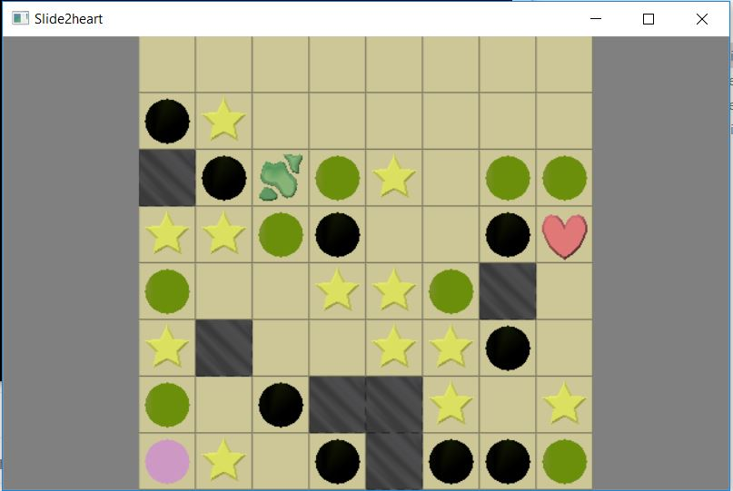
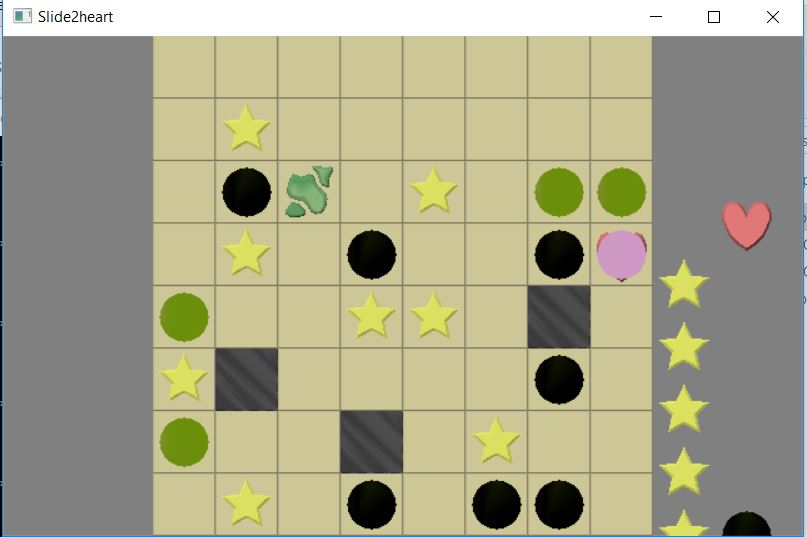

# Game Information
### Title: Slide2Heart
Author: Vivek Gopal Ramaswamy  
Andrew id: vgramasw@andrew.cmu.edu  

Design Document:     
[game0-design](https://github.com/vivekgr/game0-design)

Screen Shot:  


  

Difficulties Encountered:  
These are the following difficulties which I had faced:
1. Understanding the blender software for drawing game assets
2. comprehending the flow on how to extract information and put all of them in the Vertex buffer
3. Debugging object rendering-This took a lot of time and still I am not convinced to why it is happenning.

Good Code:  
Given my game, the objective was to place objects randomly and then check for special cases like collision or a 90 degree turn or a increment in the score. I came up with an algorithm using vectors and conversion of 2D coordinates to 1D indices(using the grid as a column major). So everytime an object is placed in the grid, the corresponding 2D coordinates would be converted to 1D indices and will be stored in the vector.When the cursor moves to that particular location, I check whether there is an collision or not.

Things that can be improved/added:  
1. Reset button 
2. Add sound
3. Text to display the scores
4. Make it more interactive  

# Using This Base Code

Before you dive into the code, it helps to understand the overall structure of this repository.
- Files you should read and/or edit:
    - ```main.cpp``` creates the game window and contains the main loop. You should read through this file to understand what it's doing, but you shouldn't need to change things (other than window title and size).
    - ```Game.*pp``` declaration+definition for the Game struct. These files will contain the bulk of your code changes.
    - ```meshes/export-meshes.py``` exports meshes from a .blend file into a format usable by our game runtime. You will need to edit this file to add vertex color export code.
    - ```Jamfile``` responsible for telling FTJam how to build the project. If you add any additional .cpp files or want to change the name of your runtime executable you will need to modify this.
    - ```.gitignore``` ignores the ```objs/``` directory and the generated executable file. You will need to change it if your executable name changes. (If you find yourself changing it to ignore, e.g., your editor's swap files you should probably, instead be investigating making this change in the global git configuration.)
- Files you probably should at least glance at because they are useful:
    - ```read_chunk.hpp``` contains a function that reads a vector of structures prefixed by a magic number. It's surprising how many simple file formats you can create that only require such a function to access.
    - ```data_path.*pp``` contains a helper function that allows you to specify paths relative to the executable (instead of the current working directory). Very useful when loading assets.
	- ```gl_errors.hpp``` contains a function that checks for opengl error conditions. Also, the helpful macro ```GL_ERRORS()``` which calls ```gl_errors()``` with the current file and line number.
- Files you probably don't need to read or edit:
    - ```GL.hpp``` includes OpenGL prototypes without the namespace pollution of (e.g.) SDL's OpenGL header. It makes use of ```glcorearb.h``` and ```gl_shims.*pp``` to make this happen.
    - ```make-gl-shims.py``` does what it says on the tin. Included in case you are curious. You won't need to run it.

## Asset Build Instructions

In order to generate the ```dist/meshes.blob``` file, tell blender to execute the ```meshes/export-meshes.py``` script:

```
blender --background --python meshes/export-meshes.py -- meshes/meshes.blend dist/meshes.blob
```

There is a Makefile in the ```meshes``` directory that will do this for you.

## Runtime Build Instructions

The runtime code has been set up to be built with [FT Jam](https://www.freetype.org/jam/).

### Getting Jam

For more information on Jam, see the [Jam Documentation](https://www.perforce.com/documentation/jam-documentation) page at Perforce, which includes both reference documentation and a getting started guide.

On unixish OSs, Jam is available from your package manager:
```
	brew install ftjam #on OSX
	apt get ftjam #on Debian-ish Linux
```

On Windows, you can get a binary [from sourceforge](https://sourceforge.net/projects/freetype/files/ftjam/2.5.2/ftjam-2.5.2-win32.zip/download),
and put it somewhere in your `%PATH%`.
(Possibly: also set the `JAM_TOOLSET` variable to `VISUALC`.)

### Libraries

This code uses the [libSDL](https://www.libsdl.org/) library to create an OpenGL context, and the [glm](https://glm.g-truc.net) library for OpenGL-friendly matrix/vector types.
On MacOS and Linux, the code should work out-of-the-box if if you have these installed through your package manager.

If you are compiling on Windows or don't want to install these libraries globally there are pre-built library packages available in the
[kit-libs-linux](https://github.com/ixchow/kit-libs-linux),
[kit-libs-osx](https://github.com/ixchow/kit-libs-osx),
and [kit-libs-win](https://github.com/ixchow/kit-libs-win) repositories.
Simply clone into a subfolder and the build should work.

### Building

Open a terminal (or ```x64 Native Tools Command Prompt for VS 2017``` on Windows), change to the directory containing this code, and type:

```
jam
```

That's it. You can use ```jam -jN``` to run ```N``` parallel jobs if you'd like; ```jam -q``` to instruct jam to quit after the first error; ```jam -dx``` to show commands being executed; or ```jam main.o``` to build a specific file (in this case, main.cpp).  ```jam -h``` will print help on additional options.
